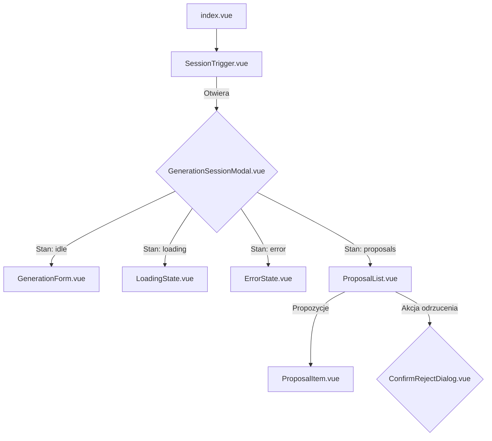

# Plan implementacji widoku: Modal Sesji Planowania AI

## 1. Przegląd
Celem jest implementacja modala sesji planowania AI, który umożliwi użytkownikom generowanie propozycji zadań na podstawie opisu celu, a następnie ich edycję, usuwanie oraz akceptację lub odrzucenie. Modal będzie zarządzał całym cyklem życia sesji planowania, od wprowadzenia opisu, przez interakcję z wygenerowanymi propozycjami, aż po zapisanie ich jako zadania w systemie.

## 2. Routing widoku
Modal nie będzie osobną stroną (trasą), lecz globalnym komponentem (`GenerationSessionModal.vue`) renderowanym warunkowo w głównym widoku aplikacji (`pages/index.vue` lub `app.vue`), najprawdopodobniej aktywowanym przez `SessionTrigger.vue`.

## 3. Struktura komponentów
Hierarchia komponentów będzie zorganizowana w celu zapewnienia reużywalności i separacji logiki.



## 4. Szczegóły komponentów

### GenerationSessionModal.vue
- **Opis komponentu:** Główny kontener i orkiestrator sesji AI. Będzie renderowany jako modal (dialog) i będzie zarządzał stanami: `idle` (oczekiwanie na input), `loading` (generowanie propozycji), `proposals` (wyświetlanie wyników), `error` (obsługa błędów) i `submitting` (zapisywanie zaakceptowanych zadań).
- **Główne elementy:** Komponent `Dialog` z `shadcn/vue`, który warunkowo renderuje komponenty `GenerationForm`, `LoadingState`, `ErrorState` lub `ProposalList` w zależności od aktualnego stanu sesji.
- **Obsługiwane interakcje:** Otwieranie/zamykanie modala.
- **Obsługiwana walidacja:** Brak bezpośredniej walidacji; deleguje ją do komponentów dzieci.
- **Typy:** `GenerationSessionViewModel`.
- **Propsy:** Brak.

### GenerationForm.vue
- **Opis komponentu:** Formularz do wprowadzenia opisu celu przez użytkownika.
- **Główne elementy:** Komponent `Textarea` na opis, licznik znaków, oraz `Button` "Generuj zadania".
- **Obsługiwane interakcje:** Wprowadzanie tekstu, kliknięcie przycisku "Generuj".
- **Obsługiwana walidacja:** Pole `description` musi zawierać od 100 do 500 znaków. Przycisk "Generuj" jest nieaktywny, jeśli warunek nie jest spełniony.
- **Typy:** Emituje zdarzenie z `CreateGenerationCommand`.
- **Propsy:** `isLoading: boolean` (do blokowania formularza podczas generowania).

### ProposalList.vue
- **Opis komponentu:** Wyświetla listę wygenerowanych propozycji zadań.
- **Główne elementy:** Kontener `div`, który mapuje tablicę propozycji i renderuje komponent `ProposalItem` dla każdej z nich. Zawiera przyciski "Akceptuj wszystkie" i "Odrzuć".
- **Obsługiwane interakcje:** Akceptacja wszystkich propozycji, zainicjowanie odrzucenia sesji.
- **Obsługiwana walidacja:** Przycisk "Akceptuj" jest aktywny tylko, gdy na liście znajduje się co najmniej jedna propozycja.
- **Typy:** `GenerationProposalViewModel[]`.
- **Propsy:** `proposals: GenerationProposalViewModel[]`.

### ProposalItem.vue
- **Opis komponentu:** Reprezentuje pojedynczą propozycję zadania na liście. Umożliwia edycję "w miejscu" (inline editing) oraz usunięcie.
- **Główne elementy:** Pola tekstowe (`Input` dla tytułu, `Textarea` dla opisu) widoczne w trybie edycji. W trybie odczytu zwykłe elementy `p`. Przyciski "Edytuj", "Zapisz", "Anuluj", "Usuń".
- **Obsługiwane interakcje:** Przełączanie w tryb edycji, zapisywanie zmian, anulowanie edycji, usuwanie propozycji.
- **Obsługiwana walidacja:** Tytuł propozycji nie może być pusty podczas edycji.
- **Typy:** `GenerationProposalViewModel`.
- **Propsy:** `proposal: GenerationProposalViewModel`.

### Inne komponenty
- **LoadingState.vue:** Wyświetla animację ładowania (np. kilka komponentów `Skeleton` z `shadcn/vue`) symulującą wygląd przyszłej listy.
- **ErrorState.vue:** Wyświetla komunikat o błędzie i przycisk "Spróbuj ponownie".
- **ConfirmRejectDialog.vue:** Prosty modal potwierdzenia z `shadcn/vue` z przyciskami "Zakończ sesję" i "Kontynuuj".

## 5. Typy

### GenerationProposalViewModel
Rozszerza `GenerationProposalTaskDTO` o pola potrzebne do zarządzania stanem w UI.

```typescript
import { GenerationProposalTaskDTO } from '~/types';

export interface GenerationProposalViewModel extends GenerationProposalTaskDTO {
  // Kliencki, tymczasowy identyfikator do zarządzania listą (np. do klucza w v-for).
  tempId: string;

  // Flaga wskazująca, czy użytkownik zmodyfikował propozycję.
  isEdited: boolean;

  // Flaga kontrolująca tryb edycji w komponencie ProposalItem.
  isEditing: boolean;
}
```

### GenerationSessionViewModel
Główny obiekt stanu przechowujący wszystkie informacje o bieżącej sesji AI.

```typescript
import { GenerationProposalViewModel } from './types';

export type GenerationSessionStatus = 'idle' | 'loading' | 'proposals' | 'error' | 'submitting';

export interface GenerationSessionViewModel {
  generationId: string | null;
  status: GenerationSessionStatus;
  description: string;
  proposals: GenerationProposalViewModel[];
  error: string | null;
}
```

## 6. Zarządzanie stanem
Stan sesji AI będzie zarządzany centralnie przy użyciu dedykowanego magazynu **Pinia** (`stores/generation.ts`). Umożliwi to zachowanie stanu sesji nawet po zamknięciu modala (zgodnie z US-004) oraz łatwą integrację z innymi częściami aplikacji.

**Store: `useGenerationStore`**
- **State:**
    - `session: GenerationSessionViewModel` – główny obiekt stanu sesji.
    - `isModalOpen: boolean` – flaga widoczności modala.
- **Actions:**
    - `generateProposals(description: string)`: wywołuje API `POST /generations` i zarządza stanami `loading`, `proposals`, `error`.
    - `updateProposal(proposal: GenerationProposalViewModel)`: aktualizuje pojedynczą propozycję w stanie.
    - `deleteProposal(tempId: string)`: usuwa propozycję ze stanu.
    - `acceptProposals()`: wywołuje w pętli API `POST /tasks` dla każdej propozycji, zarządza stanem `submitting`.
    - `rejectSession()`: resetuje stan sesji.
    - `openModal()` / `closeModal()`: kontrolują `isModalOpen`.
- **Persystencja:** Aby stan przetrwał odświeżenie strony, zostanie wykorzystany plugin `pinia-plugin-persistedstate` z `localStorage`.

## 7. Integracja API

### POST /api/generations
- **Cel:** Wygenerowanie propozycji zadań.
- **Wywołanie:** W akcji `generateProposals` w stanie Pinia, za pomocą `useFetch` z Nuxt.
- **Typ żądania:** `CreateGenerationCommand`
- **Typ odpowiedzi:** `CreateGenerationResponseDTO`
- **Obsługa:** Odpowiedź jest mapowana na `GenerationProposalViewModel[]` i zapisywana w stanie Pinia.

### POST /api/tasks
- **Cel:** Zapisanie zaakceptowanych propozycji jako zadań.
- **Wywołanie:** W akcji `acceptProposals`, w pętli (`Promise.allSettled`) dla każdej propozycji.
- **Typ żądania:** `CreateTaskCommand` (mapowane z `GenerationProposalViewModel`). `source` będzie ustawiony na `ai_edited` jeśli `isEdited` to `true`, w przeciwnym razie `ai_full`.
- **Typ odpowiedzi:** `CreateTaskResponseDTO`
- **Obsługa:** Po pomyślnym zapisaniu wszystkich zadań, sesja jest resetowana, a główna lista zadań (w innym sklepie Pinia) jest odświeżana.

## 8. Interakcje użytkownika
- **Generowanie zadań:** Użytkownik wpisuje opis (min. 100 znaków), klika "Generuj". Interfejs przechodzi w stan ładowania, a następnie wyświetla wyniki lub błąd.
- **Edycja propozycji:** Użytkownik klika "Edytuj", modyfikuje treść i klika "Zapisz". Zmiany są odzwierciedlane w stanie.
- **Usuwanie propozycji:** Użytkownik klika "Usuń", propozycja znika z listy.
- **Akceptacja:** Użytkownik klika "Akceptuj wszystkie". Przyciski są blokowane, a interfejs pokazuje stan zapisywania. Po sukcesie modal się zamyka.
- **Odrzucenie:** Użytkownik klika "Odrzuć", pojawia się dialog potwierdzający. Po potwierdzeniu sesja jest czyszczona, a modal się zamyka.

## 9. Warunki i walidacja
- **Formularz generowania:** Przycisk "Generuj" jest aktywny tylko, gdy długość opisu mieści się w zakresie [100, 500] znaków.
- **Edycja propozycji:** Przycisk "Zapisz" w trybie edycji jest aktywny tylko, gdy pole tytułu nie jest puste.
- **Lista propozycji:** Przycisk "Akceptuj wszystkie" jest aktywny tylko, gdy lista propozycji nie jest pusta.

## 10. Obsługa błędów
- **Błąd generowania (API `POST /generations`):** Jeśli API zwróci błąd (np. 400, 500), interfejs wyświetli `ErrorState` z ogólnym komunikatem i przyciskiem "Spróbuj ponownie", który ponownie wywoła akcję `generateProposals`.
- **Błąd zapisu (API `POST /tasks`):** Jeśli podczas akceptacji którekolwiek z zapytań `POST /tasks` się nie powiedzie, cały proces jest zatrzymywany. Użytkownikowi wyświetlany jest komunikat o błędzie przy przycisku "Akceptuj", a stan modala wraca do listy propozycji, umożliwiając ponowną próbę.

## 11. Kroki implementacji
1.  **Struktura plików:** Utworzenie plików dla nowych komponentów: `GenerationSessionModal.vue`, `GenerationForm.vue`, `ProposalList.vue`, `ProposalItem.vue` w katalogu `components/`.
2.  **Zarządzanie stanem:** Stworzenie sklepu Pinia `stores/generation.ts` z wymaganym stanem (`session`, `isModalOpen`) i podstawowymi akcjami (`openModal`, `closeModal`, `resetSession`).
3.  **Komponent `GenerationSessionModal`:** Implementacja logiki przełączania widoków w zależności od `session.status` (używając `v-if`/`v-else-if`). Integracja z `Dialog` z `shadcn/vue`.
4.  **Komponent `GenerationForm`:** Implementacja formularza z walidacją długości tekstu i emitowaniem zdarzenia `@generate`.
5.  **Integracja z API generowania:** Implementacja akcji `generateProposals` w stanie Pinia, w tym obsługa stanów ładowania i błędów.
6.  **Komponenty listy:** Implementacja `ProposalList` i `ProposalItem`, w tym logika wyświetlania, edycji "w miejscu" i usuwania propozycji. Połączenie ich z akcjami `updateProposal` i `deleteProposal` w Pinia.
7.  **Integracja z API zapisu:** Implementacja akcji `acceptProposals` w sklepie Pinia, w tym pętla zapytań i obsługa błędów.
8.  **Komponenty pomocnicze:** Stworzenie `LoadingState` (z `Skeleton`), `ErrorState` i `ConfirmRejectDialog`.
9.  **Podłączenie do widoku głównego:** Dodanie `GenerationSessionModal` do `pages/index.vue` i połączenie jego otwierania z `AddTaskButton.vue` poprzez sklep Pinia.
10. **Finalne testy i poprawki:** Przetestowanie całego przepływu użytkownika, w tym przypadków brzegowych i obsługi błędów.
