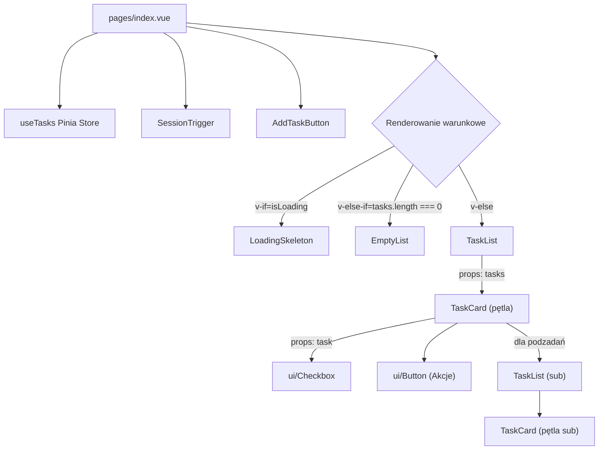

# Plan implementacji widoku Głównej Listy Zadań

## 1. Przegląd
Widok Głównej Listy Zadań jest centralnym punktem aplikacji, umożliwiającym użytkownikom zarządzanie swoimi zadaniami i podzadaniami. Umożliwia pełen zakres operacji CRUD (tworzenie, odczyt, aktualizacja, usuwanie), oznaczanie zadań jako ukończone oraz inicjowanie sesji planowania z AI. Widok ten musi być responsywny i zapewniać intuicyjną obsługę, uwzględniając stany ładowania, pustej listy oraz obsługę błędów.

## 2. Routing widoku
Widok będzie dostępny pod główną ścieżką aplikacji:
- **Ścieżka:** `/`

## 3. Struktura komponentów
Hierarchia komponentów została zaprojektowana w sposób modułowy, aby zapewnić reużywalność i łatwość w zarządzaniu.



## 4. Szczegóły komponentów

### `pages/index.vue`
- **Opis komponentu:** Główny kontener widoku. Odpowiada za orkiestrację danych, zarządzanie stanami ładowania, błędów i pustej listy oraz integrację głównych komponentów interfejsu.
- **Główne elementy:** `SessionTrigger`, `AddTaskButton`, `LoadingSkeleton`, `TaskList`, `EmptyList`.
- **Obsługiwane interakcje:** Inicjowanie pobierania listy zadań przy montowaniu komponentu.
- **Typy:** `TaskViewModel[]`
- **Propsy:** Brak.

### `TaskList.vue`
- **Opis komponentu:** Renderuje listę zadań głównych lub listę podzadań. Iteruje po przekazanej tablicy zadań i renderuje dla każdego z nich komponent `TaskCard`.
- **Główne elementy:** `TaskCard`.
- **Obsługiwane interakcje:** Przekazuje zdarzenia od `TaskCard` do strony nadrzędnej (`pages/index.vue`).
- **Typy:** `TaskViewModel[]`.
- **Propsy:** `tasks: TaskViewModel[]`.

### `TaskCard.vue`
- **Opis komponentu:** Wyświetla pojedyncze zadanie wraz z jego podzadaniami. Umożliwia edycję, usuwanie, oznaczanie jako ukończone oraz dodawanie podzadań. Działa w trybie wyświetlania lub edycji.
- **Główne elementy:** `ui/Checkbox`, `ui/Button`, `ui/Input`, `ui/Textarea`, `TaskList` (dla podzadań).
- **Obsługiwane interakcje:**
    - Przełączanie statusu ukończenia zadania.
    - Przełączanie w tryb edycji.
    - Zapisywanie zmian w zadaniu.
    - Anulowanie edycji.
    - Usuwanie zadania (z potwierdzeniem).
    - Inicjowanie dodawania podzadania.
- **Obsługiwana walidacja:** Pole `title` nie może być puste podczas tworzenia lub edycji zadania.
- **Typy:** `TaskViewModel`, `UpdateTaskCommand`, `CreateTaskCommand`, `CompleteTaskCommand`.
- **Propsy:** `task: TaskViewModel`.

### `AddTaskButton.vue`
- **Opis komponentu:** Przycisk inicjujący proces dodawania nowego zadania głównego. Po kliknięciu wyświetla nowe zadanie/podzadanie w trybie edycji.
- **Główne elementy:** `ui/Button`, `ui/Input`, `ui/Textarea`.
- **Obsługiwane interakcje:** Otwarcie i zamknięcie formularza, wysłanie formularza.
- **Obsługiwana walidacja:** Pole `title` jest wymagane. Przycisk dodawania jest nieaktywny po osiągnięciu limitu zadań dla poszczególnych poziomów zagniezdzenia.
- **Typy:** `CreateTaskCommand`.
- **Propsy:** Brak.

### Pozostałe komponenty
- **`SessionTrigger.vue`:** Przycisk otwierający modal sesji AI.
- **`LoadingSkeleton.vue`:** Wyświetla animowany szkielet interfejsu podczas ładowania danych.
- **`EmptyList.vue`:** Komunikat wyświetlany, gdy lista zadań jest pusta, z zachętą do dodania pierwszego zadania.

## 5. Typy
Do implementacji widoku konieczne będzie stworzenie frontendowego modelu widoku `TaskViewModel`, który rozszerzy `TaskListItemDTO` o pola związane ze stanem UI.

```typescript
import type { TaskListItemDTO } from '~/types';

/**
 * Rozszerza DTO zadania o stan interfejsu użytkownika,
 * ułatwiając zarządzanie trybem edycji i stanami ładowania dla każdej karty z zadaniem.
 */
export interface TaskViewModel extends TaskListItemDTO {
  isEdited?: boolean;       // Czy zadanie uległo edycji?
  subtasks: TaskViewModel[];
}
```

## 6. Zarządzanie stanem
Stanem aplikacji będzie zarządzać dedykowany store Pinia, dostępny przez composable `useTasks`.

**`stores/tasks.ts`**

- **State:**
  - `tasks: TaskViewModel[]`: Lista wszystkich zadań.
  - `isLoading: boolean`: Status ładowania początkowej listy zadań.
  - `error: string | null`: Globalny błąd (np. błąd pobierania danych).
  - `pagination: PaginationDTO | null`: Informacje o paginacji.

- **Getters:**
  - `getTaskById(taskId: string)`: Zwraca zadanie o podanym ID.
  - `canAddSubtask(parentTaskId: string, position: number)`: Sprawdza, czy można dodać podzadanie (limit 10)

- **Actions:**
  - `fetchTasks()`: Pobiera zadania z API, transformuje DTO na `TaskViewModel`.
  - `createTask(command: CreateTaskCommand)`: Tworzy zadanie, stosując aktualizację optymistyczną.
  - `updateTask(taskId: string, command: UpdateTaskCommand)`: Aktualizuje zadanie.
  - `deleteTask(taskId: string)`: Usuwa zadanie po potwierdzeniu.
  - `completeTask(taskId: string)`: Oznacza zadanie jako ukończone.
  - `setEditingState(taskId: string, isEditing: boolean)`: Zarządza trybem edycji dla zadania.

## 7. Integracja API
Integracja z backendem będzie opierać się na wywołaniach do zdefiniowanych endpointów API z użyciem `$fetch` w Nuxt. Akcje w store Pinia będą hermetyzować logikę tych wywołań.

| Akcja Frontendowa         | Metoda HTTP | Endpoint                        | Typ Żądania (`body`) | Typ Odpowiedzi             |
|---------------------------|-------------|---------------------------------|----------------------|----------------------------|
| Pobranie zadań            | `GET`       | `/api/tasks`                    | -                    | `GetTasksResponseDTO`      |
| Utworzenie zadania        | `POST`      | `/api/tasks`                    | `CreateTaskCommand`  | `CreateTaskResponseDTO`    |
| Aktualizacja zadania      | `PUT`       | `/api/tasks/{taskId}`           | `UpdateTaskCommand`  | `UpdateTaskResponseDTO`    |
| Usunięcie zadania         | `DELETE`    | `/api/tasks/{taskId}`           | -                    | `DeleteTaskResponseDTO`    |
| Ukończenie zadania        | `PATCH`     | `/api/tasks/{taskId}/complete`  | -                    | `CompleteTaskResponseDTO`  |

## 8. Interakcje użytkownika
- **Dodawanie zadania:** Kliknięcie "Nowe zadanie", wypełnienie formularza i zatwierdzenie powoduje optymistyczne dodanie zadania do listy i wywołanie API.
- **Edycja zadania:** Kliknięcie ikony edycji przełącza `TaskCard` w tryb edycji. Zapisanie zmian wywołuje API i aktualizuje dane. Anulowanie przywraca stan poprzedni.
- **Usuwanie zadania:** Kliknięcie ikony usuwania wyświetla modal potwierdzający. Po zatwierdzeniu zadanie jest optymistycznie usuwane z UI i wywoływane jest API.
- **Ukończenie zadania:** Zaznaczenie checkboxa powoduje optymistyczną zmianę wyglądu zadania (i jego podzadań) oraz wywołanie odpowiedniego endpointu API.

## 9. Warunki i walidacja
- **Limit zadań:** Przyciski do dodawania podzadań będą nieaktywne (`disabled`), jeśli odpowiednie limity (10 dla podzadań 1. poziomu) zostaną osiągnięte. Logika będzie zarządzana przez gettery w store Pinia.
- **Walidacja formularzy:** Pole `title` w formularzach dodawania i edycji jest wymagane. Walidacja po stronie klienta zapobiegnie wysłaniu pustych danych, wyświetlając komunikat o błędzie.

## 10. Obsługa błędów
- **Błąd pobierania listy:** W przypadku niepowodzenia `fetchTasks`, na ekranie pojawi się komunikat o błędzie z przyciskiem "Spróbuj ponownie".
- **Błędy operacji CRUD:** Błędy będą obsługiwane na poziomie poszczególnych komponentów. W przypadku niepowodzenia operacji optymistycznej, stan UI zostanie przywrócony, a użytkownik zobaczy powiadomienie (toast) z informacją o błędzie (np. "Nie udało się usunąć zadania").
- **Błędy serwera (500):** Wyświetlony zostanie ogólny komunikat o błędzie.
- **Brak autoryzacji (401):** Użytkownik zostanie przekierowany na stronę logowania.

## 11. Kroki implementacji
1.  **Stworzenie struktury plików:** Utworzenie plików dla strony (`pages/index.vue`) oraz komponentów (`TaskList.vue`, `TaskCard.vue`, itd.) w odpowiednich katalogach.
2.  **Implementacja store'a Pinia:** Zdefiniowanie `stores/tasks.ts` ze stanem, getterami i akcjami (na razie mogą być to puste funkcje).
3.  **Budowa layoutu strony:** Złożenie `pages/index.vue` z komponentami `LoadingSkeleton`, `EmptyList` i `TaskList`, bazując na stanie `isLoading` i `tasks.length` ze store'a.
4.  **Implementacja `TaskList` i `TaskCard`:** Stworzenie komponentów do wyświetlania statycznej listy zadań, przekazując dane przez propsy.
5.  **Integracja z API (pobieranie):** Implementacja akcji `fetchTasks` w store i wywołanie jej w `pages/index.vue` w celu załadowania danych.
6.  **Implementacja funkcji `Complete`:** Podpięcie obsługi zdarzeń do checkboxa w `TaskCard`, implementacja akcji `completeTask` w store i integracja z API.
7.  **Implementacja funkcji `Delete`:** Dodanie przycisku usuwania, modalu potwierdzającego i akcji `deleteTask`.
8.  **Implementacja funkcji `Create`:** Stworzenie komponentu `AddTaskButton` z formularzem, implementacja akcji `createTask` w store i walidacji.
9.  **Implementacja funkcji `Update`:** Dodanie trybu edycji w `TaskCard`, formularza edycji i akcji `updateTask`.
10. **Obsługa błędów i stanów krawędziowych:** Finalizacja obsługi błędów, dodanie powiadomień (toastów) i dopracowanie responsywności oraz dostępności.
